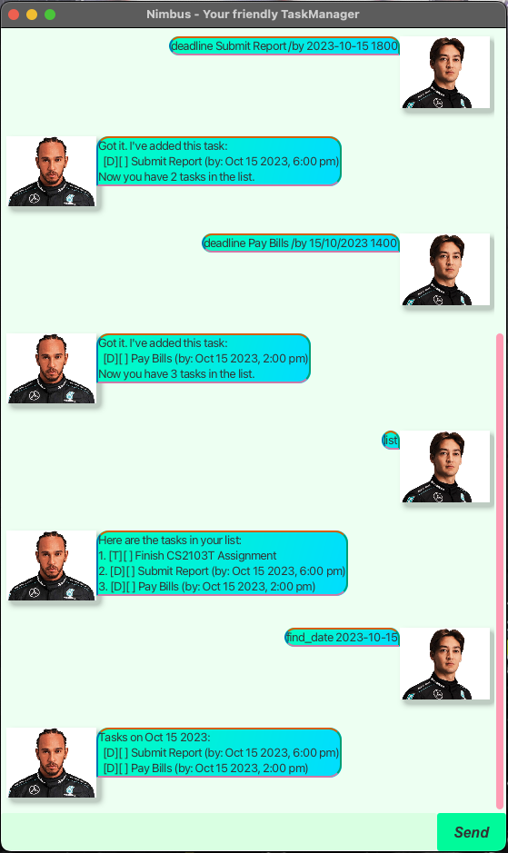

# Nimbus User Guide



> “The secret of getting ahead is getting started.” – Mark Twain

Nimbus frees your mind of having to remember things you need to do. It is:
- **user-friendly**
- *cross-platform* compatible
- ~~slow~~ **SUPER FAST** 🚀 to use

And it is **FREE**!

## Features

### 1. List Tasks

**Usage:** `list`

This command displays all saved tasks currently in your list.  
If no tasks exist, it prompts you to add some.

Expected output (when tasks exist):
```
Here are the tasks in your list:
1. [T][ ] Read book
2. [D][ ] Submit assignment (by: Dec 01 2023, 2:00 pm)
3. [E][ ] Team meeting (from: Nov 30 2023, 2:00 pm to: Nov 30 2023, 4:00 pm)
```
Expected output (when no tasks exist):
```
Hmm... Your task list is empty. Ready to add something?
```

### 2. Add Todo Task

**Usage:** `todo <task description>`  
**Example:** `todo Buy groceries`

Adds a simple todo task to the list.

Expected output:
```
Got it. I've added this task:
  [T][ ] Buy groceries
Now you have 1 tasks in the list.
```

### 3. Add Deadline Task

**Usage:** `deadline <task description> /by <date> <time>`  
**Example:** `deadline Submit report /by 2024-02-25 2359`

Adds a task with a specific deadline.

Expected output:
```
Got it. I've added this task:
  [D][ ] Submit report (by: Feb 25 2024, 11:59 pm)
Now you have 2 tasks in the list.
```

### 4. Add Event Task

**Usage:** `event <task description> /from <start time> /to <end time>`  
**Example:** `event Project meeting /from 2024-02-26 1000 /to 2024-02-26 1200`

Adds an event task with a start and end time.

Expected output:
```
Got it. I've added this task:
  [E][ ] Project meeting (from: Feb 26 2024, 10:00 am to: Feb 26 2024, 12:00 pm)
Now you have 3 tasks in the list.
```

### 5. Mark Task

**Usage:** `mark <task number>`  
**Example:** `mark 1`

Marks a task as completed.

Expected output:
```
Nice! I've marked this task as done:
  [T][X] Buy groceries
```

### 6. Unmark Task

**Usage:** `unmark <task number>`  
**Example:** `unmark 1`

Unmarks a completed task.

Expected output:
```
OK, I've marked this task as not done yet:
  [T][ ] Buy groceries
```

### 7. Delete Task

**Usage:** `delete <task number>`  
**Example:** `delete 2`

Removes a task from the list.

Expected output:
```
Noted. I've removed this task:
  [D][ ] Submit report (by: Feb 25 2024, 11:59 pm)
Now you have 2 tasks in the list.
```

### 8. Find Tasks by Date

**Usage:** `find_date <date>`  
**Example:** `find_date 2024-02-26`

Finds all tasks occurring on a specific date.

Expected output:
```
Tasks on Feb 26 2024:
  [E][ ] Project meeting (from: Feb 26 2024, 10:00 am to: Feb 26 2024, 12:00 pm)
```

### 9. Find Tasks by Keyword

**Usage:** `find <keyword>`  
**Example:** `find meeting`

Finds tasks that contain the specified keyword.

Expected output:
```
Here are the matching tasks for "meeting":
1. [E][ ] Project meeting (from: Feb 26 2024, 10:00 am to: Feb 26 2024, 12:00 pm)
```

### 10. Clear All Tasks

**Usage:** `clear`

Removes all tasks from the list.

Expected output:
```
✅ All tasks have been cleared.
```

### 11. Sort Tasks

**Usage:** `sort`

Sorts tasks in chronological order:
1. Events (earliest start time first, then by end time)
2. Deadlines (earliest due date first)
3. Todo tasks (by creation time)

Expected output:
```
Tasks sorted successfully:
1. [E][ ] Project meeting (from: Feb 26 2024, 10:00 am to: Feb 26 2024, 12:00 pm)
2. [T][ ] Buy groceries
```

### 12. Exit the Application

**Usage:** `bye`

Terminates the chatbot and displays a farewell message.

Expected output:
```
Stay awesome, and I’ll see you soon! 👋
```
